<!--- Global Settings --->
```{r global_options, include=FALSE}
knitr::opts_chunk$set(error=TRUE,        # Keep compiling upon error
                      collapse=FALSE,    # collapse by default
                      echo=TRUE,         # echo code by default
                      comment = "#>",    # change comment character
                      fig.width = 5,     # set figure width
                      fig.align = "center",# set figure position
                      out.width = "49%", # set width of displayed images
                      warning=TRUE,      # show R warnings
                      message=TRUE)      # show R messages
options(dplyr.summarise.inform = FALSE)  # ignore message about group structure
```
<!--- Required R Packages --->
```{r, include=FALSE}
#- Better table printing
library(kableExtra) # https://haozhu233.github.io/kableExtra/awesome_table_in_html.html
format_table <- function(x, nmax=10) {
  kable(x) %>% 
    kable_styling(full_width = FALSE, font_size=11, position = "left") %>% 
    {if(nrow(x) > nmax) scroll_box(., width = "100%", height = "200px") else .}
}


library(tidyverse)
library(igraph)
library(ggraph)
library(ggcorrplot)
```

<!--- Styled Region --->
```{css styled-region, echo=FALSE}
.styled {
  background-color: #232D4B10;
  border-style: solid;
  border-color: #232D4B;
  padding: .5em;
  margin: 20px
}
```
<!--- Read Data --->
```{r, include=FALSE}
dir = '/home/nadev/Repositories/graph-network-centrality'
setwd(dir)
set.seed(2019)

data = read.csv('hollywood_dataset.csv', stringsAsFactors=FALSE)
```

# Executive Summary

In graph networks, it is often desired to find the most central figure in the group. However, there are many choices of how to define and calculate centrality. Using the Hollywood network of actors and recent films as an example network we give a detailed discussion on seven different options, letting you know when to choose and how to interpret each centrality score. Finally, we also discuss how the incorporation of edge weights can change these calculations. In Hollywood, we came to the conclusion that Charlize Theron is the most central figure in recent years by a variety of the centrality types.

# Introduction

For this tutorial, we will assume that you are a novice data scientist who has been asked to find the most important or influential person in a data set. To explore the ways in which this can be accomplished, and the options you will encounter along the way, we will consider an example scenario. Say that your client is a Hollywood movie executive.

The executive says to you, "I need the most important and influential actor in Hollywood, I need them for my next film". How can we answer this question? Sure we can just say who's on the front page of a magazine, or ask someone on the street. However, that doesn't necessarily tell us who really has the most connections, or who might make this film the most money, or who might have a good enough reputation in the industry to attract talent in all departments. You're a data scientist and we have plenty of opportunities to explore! 

This tutorial is about Network Centrality, so we will investigate a network. In this instance, we will look at a network of actors connected through film industry productions aka movies or tv shows. We will look into: 

What is a Graph Network
Centrality Measures (including degree, closeness, betweenness, eigenvector, and power method)
How weights affect centrality measures (specifically credit order, movie popularity, and film profit)
Who to recommend to our client and why

To follow along with our code, the following R libraries will be required:

```{r packages, eval=FALSE, echo=TRUE}
library(tidyverse)
library(igraph)
library(ggraph)
library(ggcorrplot)
```

## IMDB Data - EDA
The first step is to obtain a thorough set of data. To obtain data on actors and the films they star in, we used two sources -- Internet Movie Database (IMDB) and The Movie Database (TMDB). IMDB contained downloadable files with film names, production year, and ordered cast. We used the TMDB API to supplement this with additional data on each movie's budget, revenue, and popularity.

To keep the dataset to a reasonable size, and to only consider recognizable actors currently taking work, we limited the data to actors at the top of the cast list of films with relatively high popularity produced more recently than 2014. It was also necessary to filter out adult movies. Since our client is concerned with Hollywood actors, we will filter out any films whose primary language is not English. Similarly, since we would like to consider the financial benefits of each actor, we will also filter out any films for which we do not have budget and revenue data. We will not go into instructions on this, as it can be done with basic SQL queries or dataframe filtering, both topics that are thoroughly covered online.

We have structured our data file such that each row has a pair of actors in the first two columns, and a film they starred in together in the third column. Additional columns of interest can be included as needed. Our data set was produced using the following SQL query:

```
SELECT actor1, actor2,
    ANY_VALUE(a.ordering * b.ordering) AS orderprod,
    ANY_VALUE(t.tconst) as film_id,
    ANY_VALUE(t.primaryTitle) as film,
    ANY_VALUE(idx.averageRating) AS ratings
  FROM (
        SELECT a.*, a.nconst AS actor1_id, b.primaryName AS actor1
        FROM imdb.title_principals AS a
        LEFT JOIN imdb.name_basics AS b ON a.nconst = b.nconst
    ) AS a
    CROSS JOIN (
        SELECT a.*, a.nconst AS actor2_id, b.primaryName AS actor2
        FROM imdb.title_principals AS a
        LEFT JOIN imdb.name_basics AS b ON a.nconst = b.nconst
    ) AS b USING (tconst)
    LEFT JOIN imdb.title_basics AS t ON a.tconst = t.tconst
    LEFT JOIN imdb.title_ratings AS idx ON idx.tconst = a.tconst
  WHERE t.startYear >= 2015 
    AND t.titleType = 'movie' 
    AND t.isAdult = 0
    AND idx.numVotes >= 5000
    AND a.ordering <= 20 AND b.ordering <= 20
    AND a.category IN ('actor','actress','self') AND b.category IN ('actor','actress','self')
    AND a.nconst < b.nconst
  GROUP BY actor1, actor2, film"
```

And the first few rows of the final data set with supplemental information joined from TMDB looks like this:

```{r}
head(data)
```

# What is a Graph Network?

Since we want to analyze connections and influence amongst actors, the best data structure to use is a graph network. A graph network is created using two bits of information -- the nodes or vertices, and the edges or connections between nodes. In our case, the vertices will be actors, and the edges will be films that actors have starred in together. Graphs support the inclusion of direction between connections which indicate if influence is flowing to or from each node in a connection. They can also include edge attributes, and vertex attributes. Both edge and vertex attributes can be used to filter the network into subgraphs or to add aesthetic distinctions like color, transparency, and size to graph visualizations. Edge attributes are also commonly used to weight the relationship between nodes in the network, making some more influential or strong than others. 

In R, the main library for network creation is [iGraph](https://igraph.org/r/doc/). We will also be using [ggraph](https://cran.r-project.org/web/packages/ggraph/index.html) for highly customizable network visualizations. Install and import these libraries, and let's get started!

As mentioned above, our data was structured with each row containing a pair of actors and a film connecting them, so our data is an edge list. Structure your data similarly, and you can quickly create an iGraph object with the following code:

```{r}
G = graph_from_data_frame(data, directed = FALSE, vertices = NULL)
```

The first two columns in the data frame will be read in as nodes in an edge list, and any remaining columns will be added as edge attributes by their column names. Our graph will be undirected, but if yours is to be directed, pass ' directed = TRUE' instead and name your first two columns 'from' and 'to' to indicate the direction for each edge. If you wish to also include vertex attributes, you can pass an additional data frame into the 'vertices' parameter with the node name in the first column and attributes as additional columns.

For now, we will be dealing with an unweighted graph, where each connection counts equally. However, if there are some connections that you can quantify as stronger or more important than others, it is best to assign it as an edge weight. If one of your edge attributes is named "weight" it will by default be considered as an edge weight in many iGraph functions. We go into more detail later about how these weights can be used. But for now, we are keeping it simple.

One cleanup item you may want to perform is simplify() to remove any duplicated edges and looped edges that point from a node back to itself. If duplicate edges are of interest to you, you can keep these counts as an attribute, and perhaps use them as an edge weight later on. In our data, we will just keep one set of edge attributes from each duplicated edge, but there are other options such as to sum them.

```{r}
E(G)$count = count_multiple(G)
G = simplify(G, edge.attr.comb="first")
```

```{r, echo=FALSE}
E(G)$orderprod = 1/data$orderprod
```

## Graph Stats

Now, let's get some basic information about your newly created network. First of all, we can count how many actors we have with vcount(), and how many connections between them using ecount(). 

```{r}
count.edges = ecount(G)
count.nodes = vcount(G)
sprintf('Our network has %i nodes, and %i edges.', count.nodes, count.edges)
```

If there are a lot of nodes, and not many edges, we call the graph sparse. However, if we have many edges, we call the network dense. If every connection possible is made, then the network is fully connected. But how many is a lot? To get an idea of how dense our network is on a scale from 0 (no connections) to 1 (fully connected), we can use the edge_density() function. With a result of 0.0039, we can see that our actor network is sparse.

```{r}
edge_density(G)
```

Another measure of graph connectedness is transitivity(). This function tells us the average probability that a node is connected to a nearby node. If there is a lot of clustering inside the network, the graph will have a transitivity close to 1. However if connections are more rare and exclusive, transitivity will approach 0. Our film network has a 37% chance of actors being connected to its neighbors.

```{r}
transitivity(G)
```

At this point it may also be good to visualize the network to see its shape and density. To do this, we can use the basic plot() function for now. The main option to consider with a network visualization is the layout. Experiment with a few from this source of [examples](https://www.data-imaginist.com/2017/ggraph-introduction-layouts/) until you find the right one for you. So called "force directed" type layouts like Kamada-Kawai tend to work well for creating visually pleasing plots. For especially large, dense networks try Fruchterman-Reingold or Large Graph Layout. To make a quick first pass, we will use the handy layout_nicely() function to let iGraph determine the best layout algorithm for our network.

Additional options for plot, vertex, and edge appearance can be researched in the iGraph [plot documentation](https://www.rdocumentation.org/packages/igraph/versions/0.2.1/topics/plot.igraph).

```{r}
layout = layout_nicely(G)
p = plot(G, layout=layout, vertex.size=1, edge.arrow.size=0.2,
     vertex.label=NA, rescale=FALSE,
     xlim=range(layout[,1]), ylim=range(layout[,2]))
title(main = "Full Network", sub="'Layout Nicely' layout algorithm")
```

## Main Component 

Each internally connected subgroup in a network is called a component. You may notice in our visualization above that there are many little disconnected dots or groups of dots orbiting the big component. These are actors who acted together in one or two films, but have no connection to the rest of the actors network. We can get a count or histogram of components using the count_components() and component_distribution() functions respectively. Plotting the component distribution result will show number of members on the x-axis and percentage of components of that size on the y-axis.

```{r}
print(count_components(G))
plot(component_distribution(G))
```

To check out who belongs to some of these smaller components, you can use the following code to break the graph into components, and check the membership list for each of the 5 largest components after the largest one.

```{r}
# Components and membership counts
comps = components(G)
comp_sizes = comps$csize

# Size of top 5 smaller components
print(sort(comp_sizes, decreasing=TRUE)[2:6])

# Members of top 5 smaller components
lapply(
      order(comp_sizes, decreasing=TRUE)[2:6], 
      function(x) print(V(G)$name[comps$membership %in% x])
  )
```

These small components are not of interest to our client, so we will do some cleanup to remove them. The big cluster of connected nodes that will remain is called the 'main component'. Below, we create and plot a subgraph of G with only the nodes in the main component. Since this is an induced subgraph, all the non-broken connections with these nodes will remain, and any broken ones will be removed.

```{r}
G1 = induced_subgraph(G, which(comps$membership == which.max(comps$csize)))

layout = layout_nicely(G1)
plot(G1, layout=layout, vertex.size=1, edge.arrow.size=0.2,
     vertex.label=NA, rescale=FALSE,
     xlim=range(layout[,1]), ylim=range(layout[,2]))
title(main = "Main Connected Component", sub="'Layout Nicely' layout algorithm")
```

This main component has a few less nodes and edges, the density has gone up slightly, and the transitivity has gone down slightly.

```{r}
count.edges = ecount(G1)
count.nodes = vcount(G1)
sprintf('Our network has %i nodes, and %i edges.', count.nodes, count.edges)

edge_density(G1)

transitivity(G1)
```

## Clusters

At this point in your analysis, I recommend looking into clusters within your network. We will not cover this vast topic n detail in this tutorial, but I wanted to mention it for your future study. Using one of several different clustering algorithms, you can get subsets of your network that may be of interest. For example, if we had not limited our data set to English-language films in the beginning, clustering by edge betweenness (this will be further explained later on) would split our network into two distinct groups. Upon further investigation, it became apparent that these two groups correspond to the two largest film-actor networks -- Hollywood and Bollywood! We could have used these cluster memberships as an alternative method for narrowing our dataset to include only Hollywood actors.

```{r, eval=F, echo=T}
N = 2   # Number of clusters

clusts = cluster_edge_betweenness(G2, directed=FALSE, weights=NULL)

# Alternative algorithms
# clusts = cluster_leading_eigen(G2, weights=NULL, steps=N)
# clusts = cluster_fast_greedy(G2, weights=NULL)

membership = cut_at(clusts, N)
names(membership) = names(membership(clusts))

# Weight by cluster betweenness to separate on plot
for (clust in levels(as.factor(membership))) {
  sub = delete.vertices(G2, which(membership != clust))
  print(length(V(sub)))
  deg = degree(sub, mode="all", normalized = TRUE)
  V(G2)[which(membership == clust)]$clustdeg = deg
  V(G2)[which(membership == clust)]$clustdegtop = deg > quantile(deg, probs = 1-10/length(V(sub)))
}

# Layout with clusters separated
weight.community=function(row,membership,weigth.within,weight.between){
  if(as.numeric(membership[which(names(membership)==row[1])])==as.numeric(membership[which(names(membership)==row[2])])){
    weight=weigth.within
  }else{
    weight=weight.between
  }
  return(weight)
}

weights = apply(get.edgelist(G2), 1 , weight.community, membership, 2, 1)
layout = layout_with_kk(G2, weights=weights)


# Clustered Main Network
p = ggraph(G2, layout = layout) +
  geom_edge_fan(aes(alpha = E(G2)$count), color = "lightgray") +
  geom_edge_link(alpha = 0.2) + 
  geom_node_point(aes(size=degree, color=as.factor(membership)), alpha = 0.4, show.legend=FALSE) +
  scale_edge_alpha_continuous(range = c(0, 1)) +
  scale_color_manual(values=rainbow(length(levels(as.factor(membership))))) + 
  theme_void() + 
  geom_node_label(
    size=3,
    aes(
      filter = clustdegtop == 1, # Only label top in each cluster 
      label = str_replace_all(name, " ", ",\n")
    ), 
    repel = TRUE
  ) +
  labs(title = "Hollywood / Bollywood Clusters",
       subtitle = "Two Clusters using Edge Betweenness Algorithm")
print(p)
ggsave('Clusters.png', p, width=6, height=6, units='in', dpi=150)

# Extract the 'Hollywood' cluster
G3 = delete.vertices(G2, which(membership != 1))

# Extract only the main component (in case disconnections occurred)
comps = components(G3)
G3 = induced_subgraph(G3, which(comps$membership == which.max(comps$csize)))
```

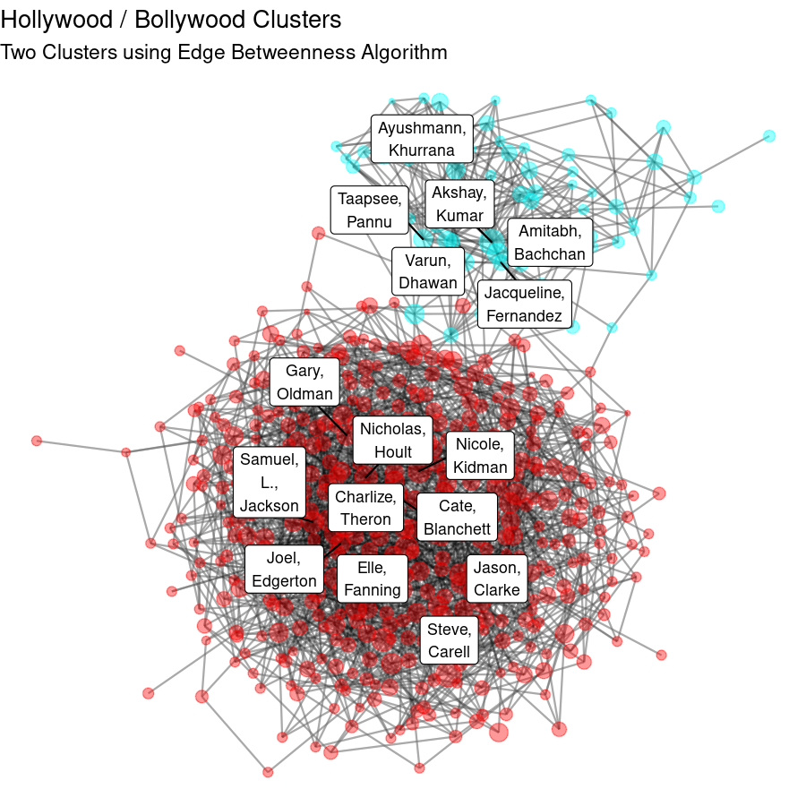

# Six degrees of who?

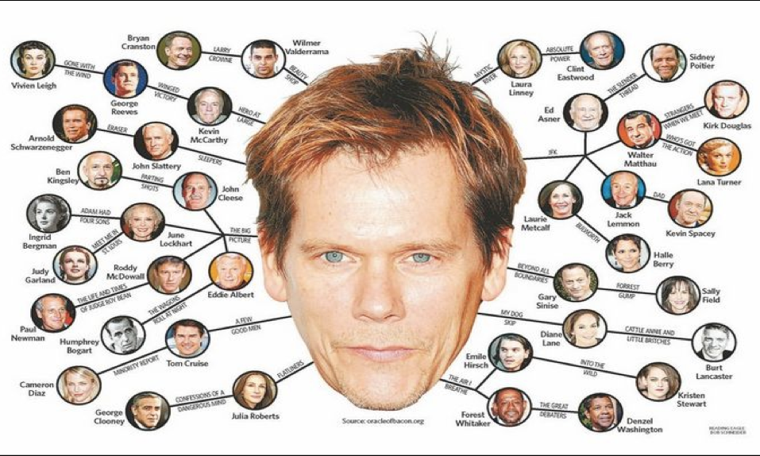
Source: https://www.iceinstitute.org/blog/2019/4/1/six-degrees-of-kevin-bacon-education-edition

Once upon a time, kids couldn't answer questions instantly with Google and IMDB. In 1994, students at Albright invented a party game called "6 Degrees of Kevin Bacon" to try to map the distance between an actor and Kevin Bacon from mutual projects. In 1996 they even sold a board game about it.  [citation: Teotonio, Isabel (September 13, 2012). "Google adds Six Degrees of Kevin Bacon to search engine". Toronto Star. Retrieved January 31, 2018.] Almost 30 years later, our executive is essentially asking us to play this game, but with today's actors. What influential central figure would be the best actor on whom to base this game today? Whoever it is, that's probably who our executive wants us to find. 

In iGraph, mean_distance() tells us on average for the whole graph how many "hops" or "degrees" there are from every combination of actor pairs. In our dataset, mean distance is 5.3. Therefore, on average there are about 5 connections between two actors. To find the longest paths between actors in our graph, we can use diameter(). Our dataset has a diameter of 14. So it appears that if we find a good central actor in this network, it is reasonable to assume that they should indeed be 6 degrees or less from virtually everyone else in Hollywood.

```{r}
print(mean_distance(G1, directed=FALSE))
print(diameter(G1, directed=FALSE, weights=NULL))
```

You might naturally ask, how do we find the shortest path? The unhelpful answer is that a single pair of actors in the same film, a single edge, is the shortest path. However, it is a more complicated and interesting question to ask how we'd find the shortest path between two actors, supposing they had many mutual acquaintances but had never worked together. That's not our focus here, but readers can check out the algorithms mentioned in the iGraph distances page (https://igraph.org/r/doc/distances.html). 

We've found the mean distance for our entire graph space, but we don't really care about Hollywood aggregate details, we want to know about individual actors. How do we find distances for individual vertices/actors? How do we find the most central actor?

# Vertex Centrality Measures

In the general sense, vertex centrality is a way to quantify the "importance" of a vertex. In other words, in our dataset, the centrality of an actor is finding how well connected they are to other actors. The most basic measure is Degree Centrality which is the number of immediate connections a node has. During COVID times, contact tracing is a crucial task to know who has been exposed to someone with the virus. Contact tracers are attempting to assess the degree centrality of a sick person and notify all their connections. Or perhaps we are analyzing a communication network and we want to find people who are most important for passing communications between distinct groups. This would be a form of Betweenness Centrality, which measures how many paths between nodes cross through a given vertex. Other applications of centrality measures might be measuring the most well cited websites on a subject, or quantifying the density of intra-familial marriages in European royalty, or assessing the true meaning of "influencer" in terms of connecting to the greatest number of nodes through the smallest number of connections. Anyways, let's figure out which actor is the biggest deal!

## Degree Centrality

degree(graph, v = V(graph), mode = c("all", "out", "in", "total"), loops = TRUE, normalized = FALSE)
https://igraph.org/r/doc/degree.html

We remember that degree centrality is literally just counting the number of unique connections one hop away from a node to other nodes, duplicate connections are not counted (even though Dwayne the Rock Johnson and Jason Statham are in 3 movies together, it only counts as 1 degree). Mathematically it's the sum of adjacencies Aij which include node di:
$C_i = \sum_j A_{ij}$
In iGraph we can find degree centrality using degree(). Sometimes a graph is directed, where the relationship between vertices is ordered. For example, if you're following a recipe, often one step must come before the other; you cannot easily cook pasta which has not yet been rolled and cut. However, our graph is not directed, two actors coexist without directionality (although hopefully with a director!), therefore we should call mode = "all". Here are some degree counts for some of our favorite actors:

Anna Kendrick: 18
Charlize Theron: 17
Dwayne Johnson: 18
Julia Louis-Dreyfus: 3
Lewis Black: 3
Rosie Perez: 3
Shia LaBeouf: 6
Tom Hanks: 12
Viggo Mortensen: 6

It's looking good for Anna Kendrick, Charlize Theron, and Dwayne (the Rock) Johnson, they have all worked with a lot of other actors!

To test out our goals, let's play 6 degrees of Anna Kendrick. How many degrees are there between Anna Kendrick and Charlize Theron?

```{r}
shortest_paths(G1, 
    as.numeric(V(G1)["Anna Kendrick"]), 
    to = as.numeric(V(G1)["Charlize Theron"]), 
    mode = "all")
```

Anna Kendrick → Jon Bernthal → Emily Blunt → Charlize Theron =  3 degrees
 
Wow that's a pretty short path, which shouldn't be that surprising between actors with so many direct connections. How many degrees between Anna Kendrick and Julia Louis-Dreyfus? 

Anna Kendrick → J.K. Simmons → Sienna Miller → Tom Holland → Julia Louis-Dreyfus =  4 degrees

Not bad at all! For comparison, how many degrees are there between Julia Louis-Dreyfus and Rosie Perez?

Julia Louis-Dreyfus → Chris Pratt → Denzel Washington → Viola Davis → Margot Robbie → Rosie Perez = 5 degrees 

Still not too bad! Maybe if they had iGraph in 1994 it wouldn't have been as impressive to find 6 degrees to Kevin Bacon. Here's what the whole graph looks like when colorized by degree, and with the top 20 highest degree actors labeled:

```{r}
V(G1)$degree = degree(G1, mode="all", normalized = FALSE)
```

```{r, eval=FALSE, echo=TRUE}
layout = create_layout(G1, layout = "drl")

ggraph(layout) +
  geom_edge_fan(aes(alpha = E(G1)$count), color = "lightgray", show.legend=FALSE) +
  geom_edge_link(alpha = 0.2, width = 0.5) + 
  geom_node_point(aes(color=degree), alpha = 0.6) +
  scale_color_viridis_c(direction = -1) + 
  theme_void() + 
  geom_node_label(
    size=3,
    aes(
      filter = degree > quantile(V(G1)$degree, probs = 1-20/length(V(G1))), # Only label top 20 
      label = str_replace_all(name, " ", ",\n")
    ), 
    repel = TRUE
  ) +
  labs(title = "Degree Centrality",
       subtitle = "Number of direct connections")

```

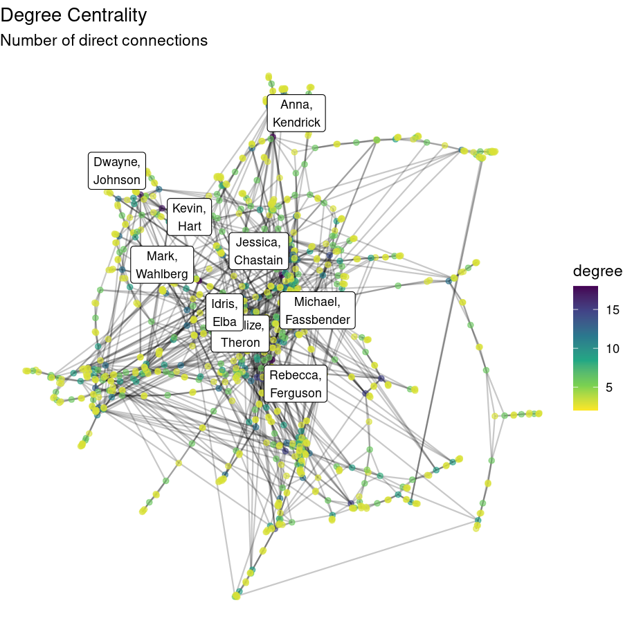

(Note: This code for plotting is virtually identical for every centrality measure with "degree" substituted with the attribute names given to each of the other metrics. I will not show this redundant code in the remaining sections.)

However, just because you've worked with a lot of people doesn't necessarily mean you're important or highly connected to the rest of the network. 

## Closeness

Another way to think about centrality is how long would it take to reach all the other nodes in the network. If you're so important, how many people do you have to talk to make a connection with that person over there? Closeness gets at the concept of an "influencer", someone who can reach a LOT of people through their direct network of friends and their friends. An actor with a high closeness value would probably act in a lot of movies with a wide range of actors and work with a lot of other actors who do the same. These actors would surely know lots of people and be able to find the fight team for any film job.  

Mathematically we can calculate closeness by adding up the distance between one node and all other nodes, but if that were the case then an influencer node would have the shortest distance to all other nodes and thus have the smallest value. Since bigger is better, apparently, we want to find a number to maximize, so we can just divide one by the sum of distances. That way the influencer node would have the biggest closeness value. The formula for closeness looks like this: 
$C(x) = \frac{1}{\sum_y d(y,x)}$
C(x) - the final closeness measure for node x
d() - distance in "hops" between nodes
y - a random node in the network which is not x

closeness(graph, vids = V(graph), mode = c("out", "in", "all",   "total"), weights = NULL, normalized = FALSE)
https://igraph.org/r/doc/closeness.html

In iGraph we can use the closeness() function, again for our example which is undirected we can use mode = "all". This and many other centrality functions can use edge weights in their calculations, but we are using unweighted calculations for now. So, we set weights = NA. Here are the closeness values for our actor crew:

(all numbers below are multiplied by 10,000 for readability)

```{r}
weights = NA    #unweighted

V(G1)$closeness = closeness(G1, weights = weights, normalized = FALSE)
```

Anna Kendrick: 2.44
Charlize Theron: 2.85
Dwayne Johnson: 2.39
Julia Louis-Dreyfus: 2.17
Lewis Black: 1.98
Rosie Perez: 2.08
Shia LaBeouf: 1.73
Tom Hanks: 2.23
Viggo Mortensen: 1.91

Once again Anna Kendrick, Charlize Theron, and the Rock on top! While Shia LaBeouf is well known, apparently he has not acted in a lot of diverse media. 

Here is a plot of our network of actors based on closeness:

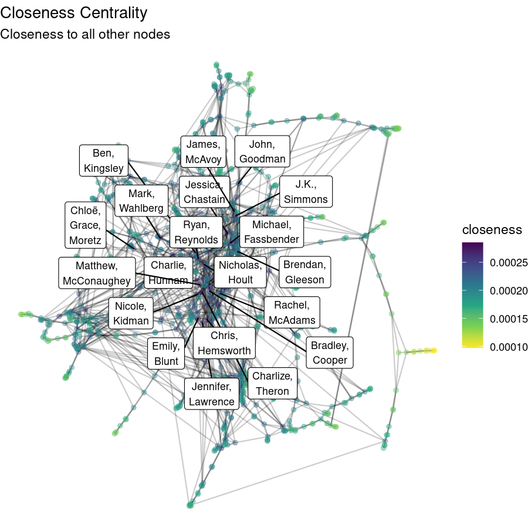

## Betweenness

Our executive is a big fan of really niche films, specifically horror movies set in forests. We don't judge here, whatever floats your heads, er, boat. We would definitely get the executive on board if they get super excited about the actor that bridges the gap between horror and standard Hollywood films. If we were to find the path between every combination of nodes, who appears the most in those paths? In practice, this calculation is a great way to bridge the gap between different clusters in a network. 

Betweenness centrality calculates this number by adding up the total number of shortest paths between nodes and then counting the number of those paths including a node of interest. Finally divide the second number by the first number. Mathematically it looks like this:
$g(v)$
$g(v)$ is the betweenness centrality for node $v$
$v$ is the node of interest
$s$ is any random node which is not $v$ or $t$
$t$ is any other random node which is not $v$ or $s$
$\sigma st$ is the total number of shortest paths from all nodes $s$ to $t$
$\sigma st(v)$ is the number of $\sigma st$ paths that include node $v$

betweenness(graph, v = V(graph), directed = TRUE, weights = NULL, nobigint = TRUE, normalized = FALSE)
https://igraph.org/r/doc/betweenness.html

We can use the iGraph function betweenness to calculate this. On our dataset, here are betweenness scores for our actors:

Anna Kendrick: 18,427.3
Charlize Theron: 35,081.5
Dwayne Johnson: 12,916.7
Julia Louis-Dreyfus: 0
Lewis Black: 0
Rosie Perez: 0
Shia LaBeouf: 2,880
Tom Hanks: 10,728.2
Viggo Mortensen: 8,586

Charlize Theron appears to have the highest betweenness score in our entire dataset, while Julia Louis-Dreyfus, Lewis Black, and Rosie Perez do not appear in the shortest path between any two actors. I'm starting to suspect that Charlize Theron may, in fact, be a pretty big deal. Also she has been in horror films, our executive will be so pleased! 

```{r}
V(G1)$betweenness = betweenness(G1, directed=FALSE, weights = weights, normalized = FALSE)
```

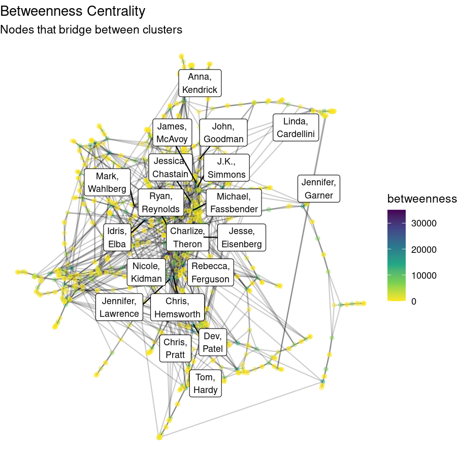

## Eigen, Authority, and Hub

How do you know if an actor is really a big deal? What if an actor just works nonstop, I'm sure others admire them a lot, but it may not be a matter of choice/thoughtfulness and instead a workaholic problem. What if we wanted to find actors who carefully choose who to work with, and they just happen to be important people to work with? 

Eigenvector centrality is a technique to calculate just that. Important nodes are connected to other important nodes, which while tautological is nonetheless important. 

$c(v) = \alpha \sum_{{u,v} \in E} c(u)$
$c(v)$ is eigenvector centrality score for node $v$
$u$ is another node which is not $v$
$E$ is all combinations of the node of interest and other nodes
$\alpha$ is a scaling constant which must be calculated

One way to calculate the eigenvector centrality is using an E-M algorithm, which calculates alpha then centrality then back and forth until it reaches equilibrium and no longer changes. There are more efficient ways to calculate it, which Google can help you find! Not least because Google's PageRank algorithm is based on the normalized eigenvector centrality score, just combined with a random jump assumption. Here are the eigenvector centrality scores for our actors:

Anna Kendrick: 0.339
Charlize Theron: 1
Dwayne Johnson: 0.204
Julia Louis-Dreyfus: 0.110
Lewis Black: 0.067
Rosie Perez: 0.094
Shia LaBeouf: 0.010
Tom Hanks: 0.109
Viggo Mortensen: 0.027

Wow well the highest score in our dataset is a perfect one, and at this point no surprise, Charlize Theron has the highest eigen score. This tells us that Charlize Theron consistently works with a wide range of important people throughout the network. 

There are other centrality scores related to Eigen scores, but they only have an effect if we use weights: Authority and Hub scores. For more information, refer to the Stanford page on them: https://nlp.stanford.edu/IR-book/html/htmledition/hubs-and-authorities-1.html. 

```{r}
V(G1)$eigen = eigen_centrality(G1, directed = FALSE, scale = TRUE, weights = weights)$vector

V(G1)$authority = authority_score(G1, scale = TRUE, weights = weights)$vector

V(G1)$hub = hub_score(G1, scale = TRUE, weights = weights)$vector
```

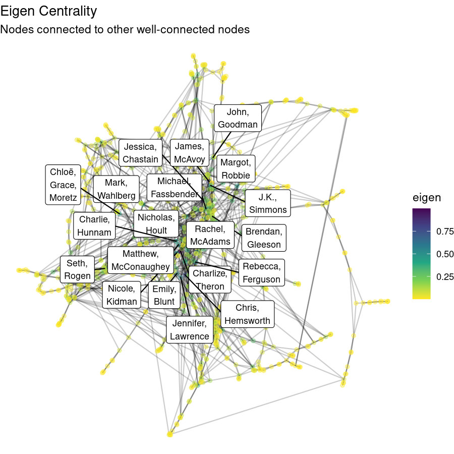

## Alpha

What if we like the eigenvector method, but there's another factor that's important to us and we want that to also have influence on the equation? What if, let's say, profitability also matters to our executive, and the relative importance of the actor is crucial, but not absolutely everything needed. We could include that in our equation, but we also have to describe how much influence profitability should have, is it 100% or 0% or somewhere in between? 

The math looks like this: 
$x_i = \alpha A^T_{i,j} x_j + ei$
$xi$ is the resulting influence of node $i$
$\alpha$ is how much influence the additional (exogenous) factor has over eigenvalue
$A$ is the adjacency matrix of the graph
$ei$ is the amount of influence of node $i$ as calculated with help from $\lambda$, the node's eigenvalue

In iGraph we can use the alpha_centrality function.

alpha_centrality(graph, nodes = V(graph), alpha = 1, loops = FALSE, exo = 1, weights = NULL, tol = 1e-07, sparse = TRUE)
https://igraph.org/r/doc/alpha_centrality.html

Here our alpha centrality scores take into account a new exogenous factor --  the order of crediting for each actor in an edge. Actors who are a big deal get listed at the top of the credits, like FEATURING LEWIS BLACK usually shows up before Key Grip: John Smith. Although I'm sure John Smith did a great job…. um.. gripping something, the audience will probably recognize Lewis Black and, depending on how the person feels, maybe convince them more to see the film.  We took the product of order for each actor and then inverted to make higher numbers indicate being high on the credit list. The following scores were the result:

Anna Kendrick: -0.75
Charlize Theron: -0.06
Dwayne Johnson: 0.31
Julia Louis-Dreyfus: 1.46
Lewis Black: 1.56
Rosie Perez: -1.80
Shia LaBeouf: 0.74
Tom Hanks: 0.22
Viggo Mortensen: 1.30

It's Lewis Black's time to shine! Apparently he is well connected in films where he is high up on the credit list.  For the first time, Charlize Theron is middle of the pack, probably because she has acted with so many actors, many high in the credits, but also many low.

```{r}
V(G1)$alpha = alpha_centrality(G1, alpha = 0.8, loops = FALSE,
                 exo = E(G1)$orderprod, weights = weights, tol = 1e-07, sparse = TRUE)
```

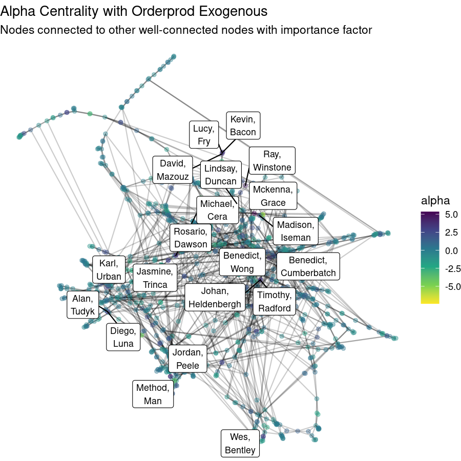

## Power

Yet another way to figure out the most important person in a network is how much power do they have over others? Let's assume for a second that all relationships are transactional, and you only expand your network because you want something from people. A powerful person probably has a lot of social capital and adds people to their network only if they want to, in a disposable way where if they are displeased, they might go ahead and remove that person from their network at no detriment to their own social status. That's a demonstration of power imbalance, and we can try to quantify that using power centrality. 

In power centrality, a node's score is based on the power of those around it. If we set a positive value for the exponential decay rate parameter, a node is more powerful if those around it are powerful. This models cooperative networks well. Charlize Theron would have a high cooperative Power Centrality score only if the others close to her in the network have a high amount of power/centrality. Alternatively we can use a negative exponent to prioritize hierarchical/competitive networks where there's a higher score for being surrounded by less powerful nodes. Another way to think of this is that a node surrounded by other powerful nodes is not bringing up the average power of that cluster. However, if a social group only has one powerful person in it, their removal from the group would greatly alter the group's average social status. Certainly there exist actors out there who care more about feeling important and wielding power over others, so they surround themselves with weaker people to feel strong. The magnitude of the exponent indicates how quickly power decays with distance away from the node. Set this closer to 1 to consider power across more of the network, and closer to 0 to consider power more locally.

Mathematically we can calculate Bonacich's Power Centrality score with:

$C_{BP}(alpha,beta)=alpha (I-betaA)^{-1} A$

$alpha$ is the exponential decay rate factor, which decides between a cooperative model (1) or a competitive model (-1)
$beta$ represents an attenuation exponent 
$A$ is the Adjacency matrix

I am guessing our executive wants to work with actors who are connected to other top actors to grow his network, so we will prioritize a cooperative network! 

(all numbers below are multiplied by 10,000 for readability)

Anna Kendrick: 2.63
Charlize Theron: 0.01
Dwayne Johnson: 1.96
Julia Louis-Dreyfus: 3.53
Lewis Black: -9.65
Rosie Perez: -1.90
Shia LaBeouf: 2.56
Tom Hanks: 2.08
Viggo Mortensen: 0.19

Out of our actors of interest, Julia Louis-Dreyfus seems to have the highest positive power centrality score, which tells us that she has worked with many other actors with a similar power to her. In contrast to that is Lewis Black, who has the lowest power score at -9.65, which tells us that he has worked with a lot of actors with a different power score than him. This doesn't tell us necessarily that Lewis Black has more power than his network, simply that his connections do not have the same level of power as him. 

```{r}
# Cooperative
V(G1)$pospower = power_centrality(G1, loops = FALSE,
                 exponent = 0.9, rescale = TRUE, tol = 1e-07, sparse = TRUE)

# Competitive 
V(G1)$negpower = power_centrality(G1, loops = FALSE,
                                  exponent = -0.9, rescale = TRUE, tol = 1e-07, sparse = TRUE)
```


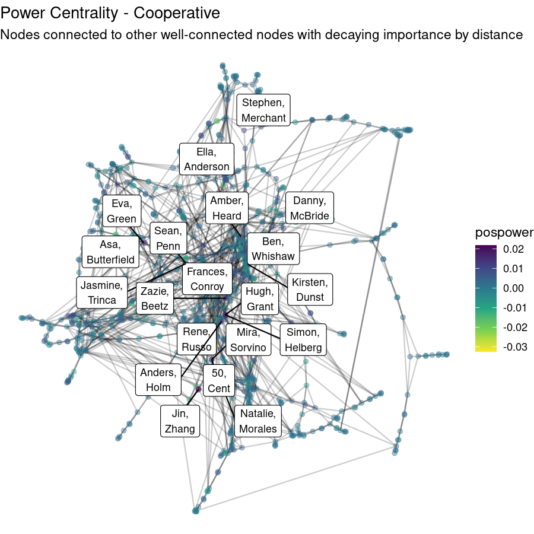

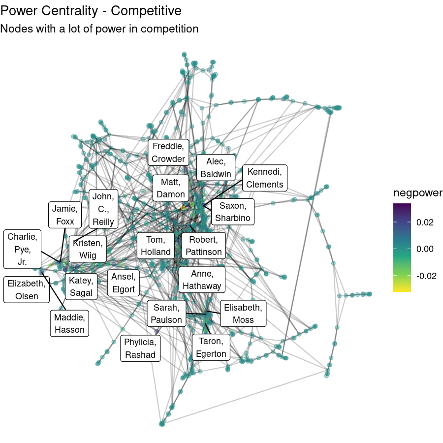

## Subgraph

Subgraph centrality is similar to closeness and eigen centrality. But instead of counting hops to each other node in the network, it counts the number of people in every possible closed walk path that can be formed from the node back to itself. This calculation is very intensive, so this is only practical with relatively small networks. This method has the benefit that it can distinguish power better than eigen centrality in highly connected networks. If you have a really connected network where every node has roughly the same degree centrality, all the nodes will have similar eigen centralities, but their subgraph centrality will show more variance. Our network is relatively sparse, so we will likely not need this method. To that end we have not included calculations for individual actors, we will not recommend anyone to our executive based on this method. 

$SC(u)=\sum_{j=1}^{N}(v_{j}^{u})^2 e^{\lambda_{j}}$

where v_j is an eigenvector of the graph's adjacency matrix A corresponding to the eigenvalue l$\lambda_{j}$.

```{r}
V(G1)$subgraph = subgraph_centrality(G1, diag = FALSE)
```

## Correlations

To summarize our options for measuring centrality, we can check how the results of each metric correlate with one another. To do this, an edge attribute was saved for each metric, attribute data was converted to a data frame, and a correlation plot was created with the ggplot library. Positive correlations indicate that the metrics increase together, and the metrics would in general rate more of the same people as high and low as the magnitude approaches 1. Negative correlation would mean that the metrics are opposite, where one rates a person high, the other would rate them low. If a correlation is close to 0, it means that there is no trend to be found at all to relate results of the two measures.

```{r, eval=FALSE, echo=TRUE}
centralities = as.data.frame(vertex_attr(G1))[,-1]   # skip first column with vertex names

ggcorrplot(cor(centralities), type = "lower",
           outline.col = "white", lab=TRUE, hc.order=TRUE,
           colors = c("blue", "lightgray", "red"),
           title="Centrality Correlations - Unweighted")
```

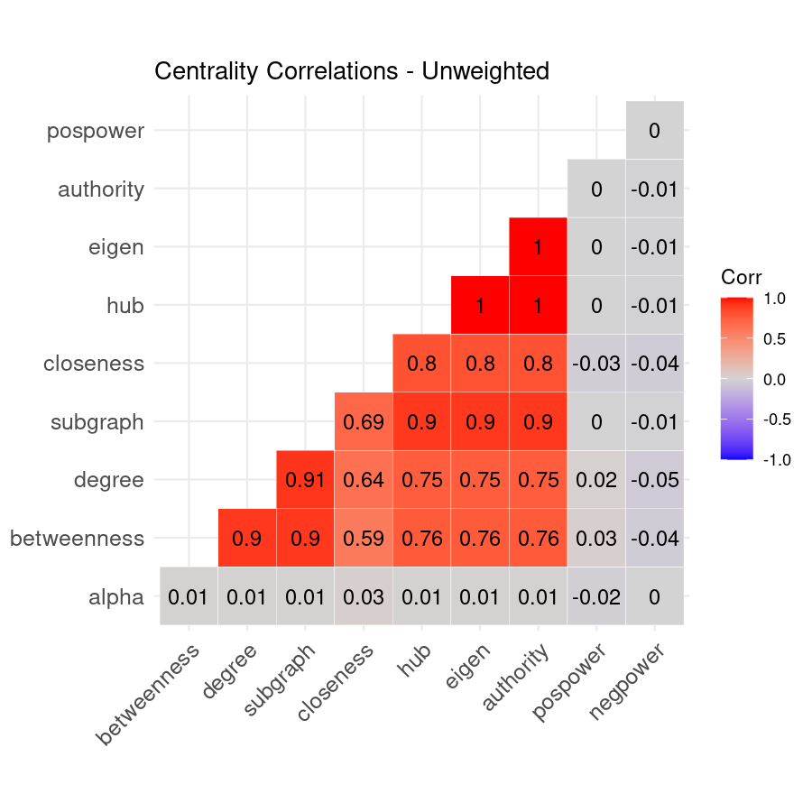

We can see from these results that the most similar centrality measures are eigen, hub, and authority. In fact, for unweighted, undirected networks like ours these will always be identical. These are also very highly correlated with subgraph and closeness centrality.

Degree centrality is highly correlated with all other measures besides power and alpha. This is especially true of betweenness and closeness centrality. This is why it is so commonly used. Your results will be a little different with other centralities, but in general those with higher degree centrality tend to also be central using other metrics. In graphs with different densities , the magnitude of this correlation may differ, but the sign will likely remain positive. If weighting is used, this can also drastically change your results.

Power centralities and alpha centralities are not the opposite of the others (that would be a high negative correlation), but seem to be very different and unrelated. These unique centralities are more difficult to interpret, but can be very powerful and give you surprising insights when your use case is right for them.

# Weights

As was mentioned previously, adding weights to a network can mark some edges as more important than others. When calculating centrality, most functions will count weighted edges with their weight instead of 1 in a weighted network. The only exception is degree centrality, which ignores weights. This may seem like added complication, but the option of weighting can make your calculations much more realistic and meaningful. For example in our earlier COVID contact tracing example, we might weight a contact by how much time was spent together. This makes the network more accurately reflect the risk of infection spread.

Since our executive is looking for influential actors for the purpose of making the big bucks in the movie industry, it would make sense for us to consider financials in our calculations. But there are other weighting options we could think of as well. For example, if actors are in movies together multiple times, their connection may be stronger, so we may weigh by count of common films. Or, if we think more highly rated actors will lead to more notoriety for the director, our executive may like the results with edges weighted by film popularity.

We will focus on four different weighting variables: the order the actor appears in the credits, the net profit of the movie, the movie rating given by critics, and the movie rating given by IMDB users. 

```{r}
#profit
weights = E(G1)$profit
V(G1)$eigen_profit = eigen_centrality(G1, directed = FALSE, scale = TRUE, weights = weights)$vector

#credits
weights = E(G1)$orderprod
V(G1)$eigen_credits = eigen_centrality(G1, directed = FALSE, scale = TRUE, weights = weights)$vector

#rating-critics
weights = E(G1)$ratings
V(G1)$eigen_gen_rating = eigen_centrality(G1, directed = FALSE, scale = TRUE, weights = weights)$vector

#vote_average-user rating
weights = E(G1)$vote_average
V(G1)$eigen_user_rating = eigen_centrality(G1, directed = FALSE, scale = TRUE, weights = weights)$vector

eigen_df <- as.data.frame(vertex_attr(G1))
```

```{r}
rank_eigen = data.frame(list(1:10))
colnames(rank_eigen)[colnames(rank_eigen) == "X1.10"] <- "rank" 
eigen_cols <- c("eigen", "eigen_profit", "eigen_credits", "eigen_gen_rating", "eigen_user_rating")
#centralities_unweighted
for(i in eigen_cols){
  x = eigen_df[order(eigen_df[i],decreasing=T)[1:10],]
  rank_eigen[i] = x$name
}
```

## Credits

As we remember from the discussion on Alpha centrality, influential actors tend to show up first in the actor credits, while less influential actors tend to show up later in the credits. So if our executive is looking for an influential actor that has played a significant role in several movies, one should consider one of the following top 10 actors by eigen score. 

```{r}
rank_eigen[c('rank', "eigen_credits")]
```

The top actor is Jessica Chastain who has worked in an extensive catalogue of films such as Interstellar and The Help for which she has won an Oscar. Now let's consider the actors that we have been keeping an eye on. 

Anna Kendrick: 0.28
Charlize Theron: 0.99
Dwayne Johnson: 0.10
Julia Louis-Dreyfus: 0.063
Lewis Black: 0.04
Rosie Perez: 0.098
Shia LaBeouf: 0.01
Tom Hanks: 0.09
Viggo Mortensen: 0.02

Of our actors of interest, Charlize Theron has the highest eigen score, which tells us that she has had many influential roles and works with others who have had influential roles. This can lead to an impressive red carpet lineup if the star invites all of their friends to the premiere! Conversely, Shia LaBeouf has a lower eigen score which indicates he hasn't starred in movies with other big actors.

## Profit

Suppose our executive wants a talented recognizable actor for their film. Then it makes sense to look at net movie profits. If a movie made a lot of money it implies that it has been seen by a lot of people and they will likely recognize your star. Given that we cannot have negative weights any movies that lost money or did not make any profit were replaced with 0.01. 

```{r}
rank_eigen[c('rank', "eigen_profit")]
```

A notable string that connects the top four actors, Domhnall Gleeson, Daisy Ridley, John Boyega, and Oscar Isaac is that they are all influential characters in the new Star Wars films which have always been very financially successful. However, suppose that another Star Wars movie is coming out and our top four picks are unavailable. Consider our actors of interest:

(all numbers below are multiplied by 100,000 for readability)

Anna Kendrick: 0.002
Charlize Theron: 387.34
Dwayne Johnson: 0.66
Julia Louis-Dreyfus: 4.134e-12
Lewis Black: 0.52
Rosie Perez: 0.039
Shia LaBeouf: 0
Tom Hanks: 0.0009
Viggo Mortensen: 0.00005

Notably Julia Louis-Dreyfus has a very low eigenvector centrality score which makes sense since she is known for romcoms and smaller comedies. Conversely Charlize Theron has been in several big blockbuster hits such as Mad Max: Fury Road and has worked with others who have been in profitable films. 

## Ratings

Suppose our executive wants an actor that has been in highly rated films to try and draw in fans from other movies. There are two ways to measure the movie rating, a rating given by critics and a rating given by movie goers since the scores don't always go hand in hand. If our executive is looking to earn some awards for their film we should put more weight on films that critics liked. While if our executive is looking to make a film that is loved by fans we should put more weights on films that fans liked.  

### Movie Ratings From Critics

The top 10 most influential actors that have acted in and acted with critically acclaimed films are:

```{r}
rank_eigen[c('rank', "eigen_gen_rating")]
```

Anna Kendrick: 0.28
Charlize Theron: 1
Dwayne Johnson: 0.15
Julia Louis-Dreyfus: 0.14
Lewis Black:0.08
Rosie Perez: 0.07
Shia LaBeouf: 0.013
Tom Hanks: 0.11
Viggo Mortensen: 0.04

### Movie Ratings From Users

The top 10 most influential actors that have acted in and acted with audience acclaimed films are:

```{r}
rank_eigen[c('rank', "eigen_user_rating")]
```

Of the actors with the top 10 eigen scores, all but Octavia Spencer and Rachel McAdams have all been in a Marvel movie. So getting an actor who is recognizable from a Marvel movie would help draw in audiences that will give the movie a high rating. However, suppose that marvel is making another superhero movie and they are all unavailable. Consider our actors of interest:

Anna Kendrick: 0.018
Charlize Theron: 0.21
Dwayne Johnson: 0.14
Julia Louis-Dreyfus: 0.39
Lewis Black: 0.01
Rosie Perez: 0.02
Shia LaBeouf: 0.005
Tom Hanks: 0.02
Viggo Mortensen: 0.09

Out of our actors of interest, Julia Louis-Dreyfus seems to have the highest weighted eigenvector centrality score, which tells us that she is an influential actor that has created some fan favorite films. While our lowest scoring actor is Shia LaBeouf which doesn't necessarily mean that he hasn't acted in any well received films but he hasn't acted with many people who have starred in well received films. 

Comparing the top scoring actors considering the movie ratings it is clear that there is a significant difference between what critics decide are good films and what audiences decide are good films. 

```{r}
rank_eigen[c("rank","eigen_gen_rating", "eigen_user_rating")]
```

So it must be up to our executive to decide what kind of good film they want to make. 

# Conclusion

Now that we've explored this network pretty thoroughly and seen a variety of ways to identify the most "important" actors, we can decide what to share with our executive. It's always a helpful practice to provide a range of options and afterwards say what we think would be the best choice. 

Different goals:

Find the most important actor across Hollywood productions, with the highest value connections, the highest film ratings, and the most recent work:
Charlize Theron (based on most centrality measures, especially eigenvector centrality either unweighted, weighted by film rating, or weighted by film age)

Find the most important actor with the most profitable film credits:
Star Wars actors including John Boyega, Daisy Ridley, Domhnall Gleeson, Oscar Isaac
(based on Eigenvector centrality weighted by film profitability)

Find the most important actor who is popular with their audience:
Marvel film actors including Chris Evans, Robert Downey Jr, Mark Ruffalo, Scarlett Johansson, Tom Holland, Chris Pratt, Chris Hemsworth, etc. (based on Eigenvector centrality weighted by IMDB film user rating)

If we were choosing an important actor overall, it seems to clearly be Charlize Theron. The Star Wars and Marvel franchises are unique circumstances where in theory they could maintain the same level of profit and user ratings with less sensitivity to which actors they choose. But independent of organized franchise marketing and continuity, it seems as though the answer must be Charlize Theron. If we were to attempt to recreate the game 6 Degrees of Kevin Bacon today, we would instead need to make it 6 Degrees of Charlize Theron. No IMDB allowed, that's cheating! 

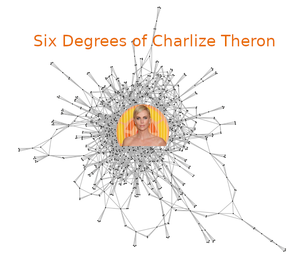

# Sources Consulted

Centrality Measures  
https://cambridge-intelligence.com/keylines-faqs-social-network-analysis/  
http://netrankr.schochastics.net/index.html  
https://rpubs.com/pjmurphy/313180  
https://beanumber.github.io/mdsr2e/ch-netsci.html#extended-example-six-degrees-of-kristen-stewart  

Clusters  
https://www.gastonsanchez.com/visually-enforced/how-to/2014/06/29/Graph-from-dendrogram/  
https://www.csc2.ncsu.edu/faculty/nfsamato/practical-graph-mining-with-R/slides/pdf/Graph_Cluster_Analysis.pdf  


